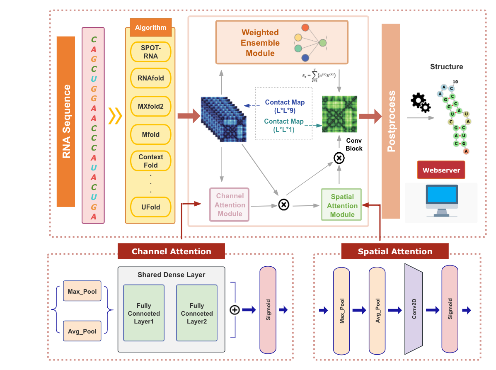
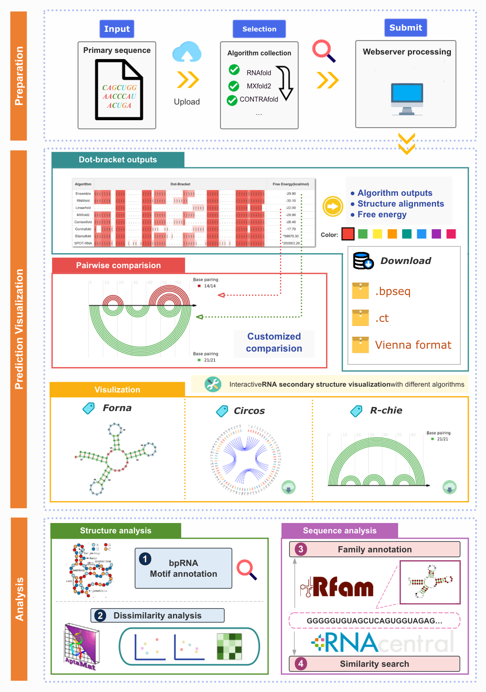

<!-- Improved compatibility of back to top link: See: https://github.com/othneildrew/Best-README-Template/pull/73 -->

<!--
*** Thanks for checking out the Best-README-Template. If you have a suggestion
*** that would make this better, please fork the repo and create a pull request
*** or simply open an issue with the tag "enhancement".
*** Don't forget to give the project a star!
*** Thanks again! Now go create something AMAZING! :D
-->

<!-- PROJECT SHIELDS -->
<!--
*** I'm using markdown "reference style" links for readability.
*** Reference links are enclosed in brackets [ ] instead of parentheses ( ).
*** See the bottom of this document for the declaration of the reference variables
*** for contributors-url, forks-url, etc. This is an optional, concise syntax you may use.
*** https://www.markdownguide.org/basic-syntax/#reference-style-links
-->
[![Contributors][contributors-shield]][contributors-url]
[![Forks][forks-shield]][forks-url]
[![Stargazers][stars-shield]][stars-url]
[![Issues][issues-shield]][issues-url]
<!-- Variables -->
[contributors-shield]: https://img.shields.io/github/contributors/sfsdfd62/TrioFold.svg?style=for-the-badge
[contributors-url]: https://github.com/sfsdfd62/TrioFold/graphs/contributors
[forks-shield]: https://img.shields.io/github/forks/sfsdfd62/TrioFold.svg?style=for-the-badge
[forks-url]: https://github.com/sfsdfd62/TrioFold/network/members
[stars-shield]: https://img.shields.io/github/stars/sfsdfd62/TrioFold.svg?style=for-the-badge
[stars-url]: https://github.com/sfsdfd62/TrioFold/stargazers
[issues-shield]: https://img.shields.io/github/issues/sfsdfd62/TrioFold.svg?style=for-the-badge
[issues-url]: https://github.com/sfsdfd62/TrioFold/issues

<!-- PROJECT LOGO -->
 

  <h1 align="center">TrioFold</h1>

  

   Enhanced generalizability of RNA secondary structure prediction via convolutional block attention network and ensemble learning
   
  

<!-- ABOUT THE PROJECT -->
## About TrioFold

The prediction of RNA secondary structure (RSS) is a fundamental but unmet need for RNA research. Various deep learning (DL)--based state-of-the-art (SOTA) methods achieved improved accuracy over thermodynamic-based methods. However, the over-parameterization nature of DL makes SOTA methods prone to overfitting and thus limits their generalizability. Meanwhile, the inconsistency of RSS predictions between SOTA methods further aggravated the crisis of generalizability. 

Here, we propose TrioFold to achieve enhanced generalizability of RSS prediction by integrating base-pairing clues learned from both thermodynamic- and DL-based methods by ensemble learning and convolutional block attention mechanism. TrioFold achieves higher accuracy in intra-family predictions and enhanced generalizability in inter-families and cross-RNA-types predictions. Importantly, TrioFold uses only ~2800 parameters to achieve superior performance over SOTA DL methods requiring millions of parameters. This study demonstrated new opportunities to enhance generalizability for RSS predictions by efficiently ensemble learning of base-pairing clues learned from both thermodynamic- and DL-based algorithms. 

(<a href="#readme-top">back to top</a>)

<!-- WEBSERVER -->
## Webserver

Moreover, we implemented TriFold and those base-learner methods in a one-stop user-friendly webserver to enable convenient usage for biologists without any programming requirement. The webserver provides RSS prediction and analysis functions and it can be freely accessed at [http://triofold.aiddlab.com/](http://triofold.aiddlab.com/).

(<a href="#readme-top">back to top</a>)

<!-- Prerequisites -->
## Prerequisites

Before you begin, ensure you have met the following requirements:  
Python >= 3.10  
PyTorch  >= 1.11  
Subprocess  
collections  
numpy  >= 1.23.5  

(<a href="#readme-top">back to top</a>)

<!-- LICENSE -->
## License

Distributed under the MIT License. See [LICENSE](LICENSE) for more information.

(<a href="#readme-top">back to top</a>)

